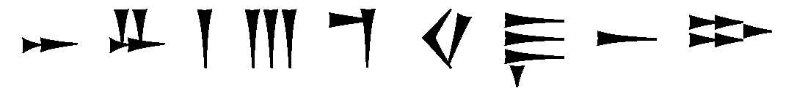
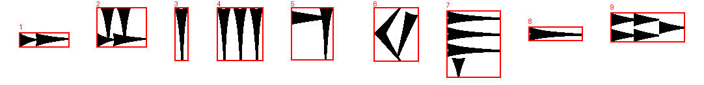
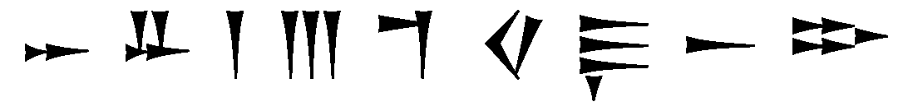

# Лабораторная работа №7
## Классификация на основе признаков, анализ профилей

### Вариант 11: Угаритский алфавит

### Исходные данные
- Фраза: `𐎀 𐎁 𐎂 𐎍 𐎎 𐎏 𐎛 𐎚 𐎗`
- Ожидаемая строка без пробелов: `𐎀𐎁𐎂𐎍𐎎𐎏𐎛𐎚𐎗`
- Шрифт: `NotoSansUgaritic-Regular.ttf`
- Основной размер шрифта: `96`
- Размер шрифта в эксперименте: `98`
- Количество символов алфавита: `30`

### Метод

Для каждого эталонного символа и каждого сегмента строки рассчитаны признаки: масса, нормированные координаты центра тяжести и нормированные осевые моменты инерции. Евклидово расстояние переведено в меру близости. Дополнительно используется сравнение нормализованных пиксельных образов.

```text
feature_score = 1 - euclidean_distance / sqrt(n)
image_score = 1 - mean(abs(normalized_segment - normalized_template))
score = 0.35 * feature_score + 0.65 * image_score
```

Сегментация выполнена по вертикальному профилю с известным числом символов строки.

### Основное распознавание





- Найдено сегментов: `9`
- Лучшие гипотезы: `𐎀𐎁𐎂𐎍𐎎𐎏𐎛𐎚𐎗`
- Ожидаемая строка: `𐎀𐎁𐎂𐎍𐎎𐎏𐎛𐎚𐎗`
- Ошибок: `0`
- Доля верно распознанных символов: `100.00%`
- Файл гипотез: `results_lab7/main/main_hypotheses.txt`

### Эксперимент с другим размером шрифта




- Размер шрифта: `98`
- Найдено сегментов: `9`
- Лучшие гипотезы: `𐎀𐎁𐎂𐎍𐎎𐎏𐎛𐎚𐎗`
- Ожидаемая строка: `𐎀𐎁𐎂𐎍𐎎𐎏𐎛𐎚𐎗`
- Ошибок: `0`
- Доля верно распознанных символов: `100.00%`
- Файл гипотез: `results_lab7/experiment/experiment_hypotheses.txt`

### Примеры первых гипотез

| № сегмента | Топ-5 гипотез основного распознавания |
|---:|:---|
| 1 | 𐎀: 0.959, 𐎐: 0.950, 𐎚: 0.906, 𐎋: 0.866, 𐎆: 0.863 |
| 2 | 𐎁: 0.962, 𐎄: 0.826, 𐎜: 0.823, 𐎅: 0.776, 𐎔: 0.765 |
| 3 | 𐎂: 0.963, 𐎇: 0.942, 𐎃: 0.912, 𐎒: 0.860, 𐎘: 0.851 |
| 4 | 𐎍: 0.958, 𐎝: 0.814, 𐎜: 0.772, 𐎂: 0.741, 𐎕: 0.728 |
| 5 | 𐎎: 0.970, 𐎍: 0.743, 𐎕: 0.731, 𐎌: 0.728, 𐎒: 0.720 |
| 6 | 𐎏: 0.975, 𐎈: 0.855, 𐎉: 0.846, 𐎌: 0.830, 𐎙: 0.805 |
| 7 | 𐎛: 0.974, 𐎔: 0.795, 𐎗: 0.795, 𐎙: 0.794, 𐎋: 0.770 |
| 8 | 𐎚: 0.962, 𐎐: 0.925, 𐎀: 0.919, 𐎋: 0.875, 𐎆: 0.874 |
| 9 | 𐎗: 0.975, 𐎔: 0.887, 𐎆: 0.876, 𐎋: 0.874, 𐎀: 0.826 |

### Вывод
Реализована классификация символов выбранного алфавита. Для каждого сегмента сформирован упорядоченный список гипотез, построена строка лучших гипотез, посчитаны ошибки и доля верно распознанных символов. Проведён эксперимент с изменённым размером шрифта.
